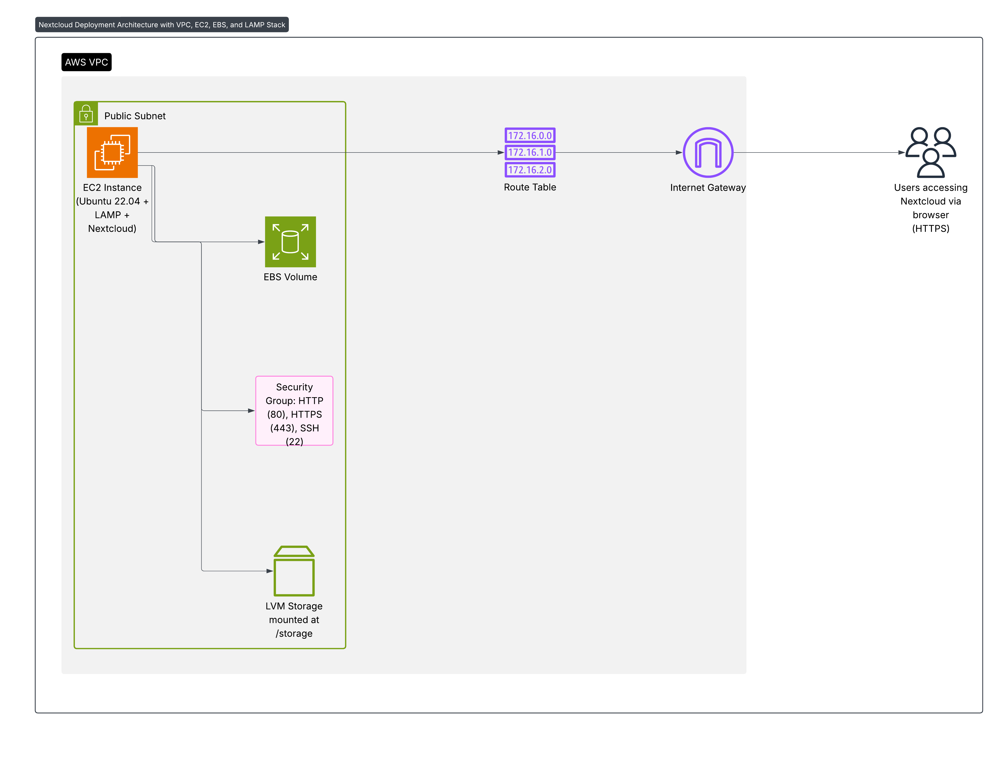

# 🚀 Nextcloud Deployment on AWS EC2 (Ubuntu 22.04 + LAMP + LVM Storage + Custom AWS VPC)


## 📌 Overview
This project showcases the **end-to-end deployment of Nextcloud** on an **AWS EC2 Ubuntu 22.04 instance** using the **LAMP stack** (Linux, Apache, MySQL, PHP).  
The setup also features **LVM-based persistent storage** mounted at `/storage` for scalability and a **Custom AWS VPC** for enhanced network isolation and security.

---

## Architecture Overview



- **AWS VPC**: Isolated network (CIDR: 10.0.0.0/16) with a public subnet (10.0.1.0/24), Internet Gateway, and routing table.
- **EC2 Instance**: Deployed within the VPC, running Ubuntu 22.04.
- **Storage**: LVM-backed volume mounted at `/storage` for scalability and persistence.
- **LAMP Stack**: Linux + Apache + MySQL/MariaDB + PHP 8.1 powering Nextcloud.
- **Security Groups**: Controlled access on ports 22 (SSH), 80 (HTTP), 443 (HTTPS).
- **Nextcloud Setup**: Installed via zip, configured under Apache with proper permissions and trusted domains.

---

## 🛠️ Features
- 🛡 **Custom AWS VPC** for secure, isolated networking.
- ☁ **Nextcloud** for private file storage and collaboration.
- ⚙ **LAMP Stack** (Apache, MySQL/MariaDB, PHP 8.1).
- 💾 **LVM-based persistent storage** at `/storage`.
- 🔐 **Security Groups** for access control.
- 🌍 **Trusted domain configuration** for public access.
- 📸 **Screenshots & visual setup guide**.

---

## 🌐 AWS VPC Setup
A **Custom AWS VPC** was created instead of using the default one to have full control over IP addressing, routing, and security.

### Steps:
1. **Create VPC** → CIDR block: `10.0.0.0/16`.
2. **Add Subnets**:
   - Public Subnet → `10.0.1.0/24`.
   - Private Subnet → optional (for DB isolation).
3. **Internet Gateway** → attach to VPC.
4. **Route Table** → public subnet routes `0.0.0.0/0` → Internet Gateway.
5. **Launch EC2** → inside public subnet with Elastic IP.
6. **Security Groups** → allow:
   - SSH (22)
   - HTTP (80)
   - HTTPS (443)

✅ **Benefits**:
- Full network isolation.
- Custom IP addressing.
- Secure integration with future AWS resources.

---

## 🧭 Project Flow

### 1. 🚀 Launch EC2

- AMI: Ubuntu Server 22.04 LTS
- Open ports: **22 (SSH), 80 (HTTP), 443 (HTTPS)**

### 2. 🔐 Connect via SSH
```bash
ssh -i "key.pem" ubuntu@your-public-ip
```

### 3. ⚙️ Install LAMP Stack
```bash
sudo apt update && sudo apt upgrade -y
sudo apt install apache2 mariadb-server php php-mysql php-gd php-xml php-curl php-mbstring php-zip php-intl php-bcmath php-gmp php-imagick unzip libapache2-mod-php -y
```

### 4. 🔒 Secure MariaDB
```bash
sudo mysql_secure_installation
```

Login and configure Nextcloud database:
```sql
CREATE DATABASE nextcloud;
CREATE USER 'nextclouduser'@'localhost' IDENTIFIED BY 'yourpassword';
GRANT ALL PRIVILEGES ON nextcloud.* TO 'nextclouduser'@'localhost';
FLUSH PRIVILEGES;
```

### 5. ⬇️ Download & Configure Nextcloud
```bash
cd /tmp
wget https://download.nextcloud.com/server/releases/latest.zip
unzip latest.zip
sudo mv nextcloud /var/www/html/
sudo chown -R www-data:www-data /var/www/html/nextcloud
sudo chmod -R 755 /var/www/html/nextcloud
```

Enable required modules and restart Apache:
```bash
sudo a2enmod rewrite headers env dir mime setenvif
sudo systemctl restart apache2
```

### 6. 💾 Add External Storage Using LVM
```bash
sudo pvcreate /dev/xvdf
sudo vgcreate nxtcld /dev/xvdf
sudo lvcreate -L 20G -n lvol0 nxtcld
sudo mkfs.ext4 /dev/nxtcld/lvol0
sudo mkdir /storage
sudo mount /dev/nxtcld/lvol0 /storage
echo '/dev/nxtcld/lvol0 /storage ext4 defaults 0 2' | sudo tee -a /etc/fstab
```

### 7. 🌐 Final Setup via Web
- Visit `http://<your-public-ip>/nextcloud`
- Fill in admin credentials
- Use `/storage` as data folder path
- Add database info

## 📸 Screenshots

---

## 📜 License
Licensed under the **MIT License** – feel free to use and modify.

---
💡 *This project is a complete beginner-to-intermediate guide for deploying a secure, production-ready Nextcloud instance on AWS.*

